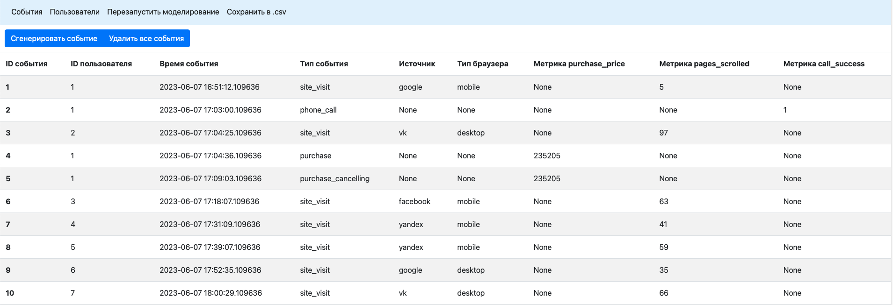
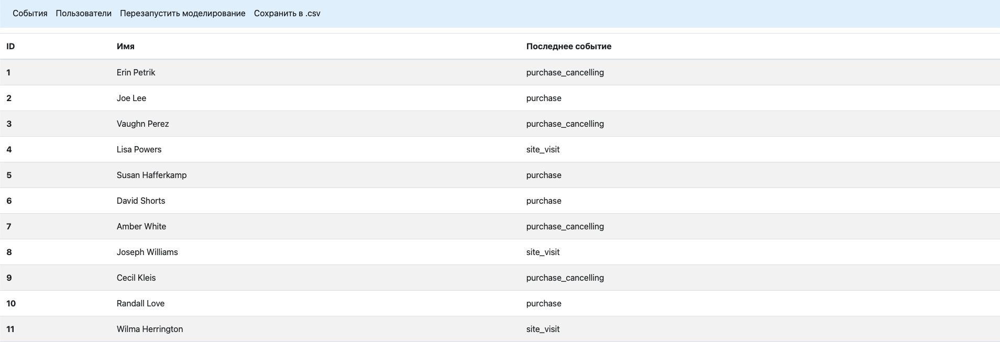
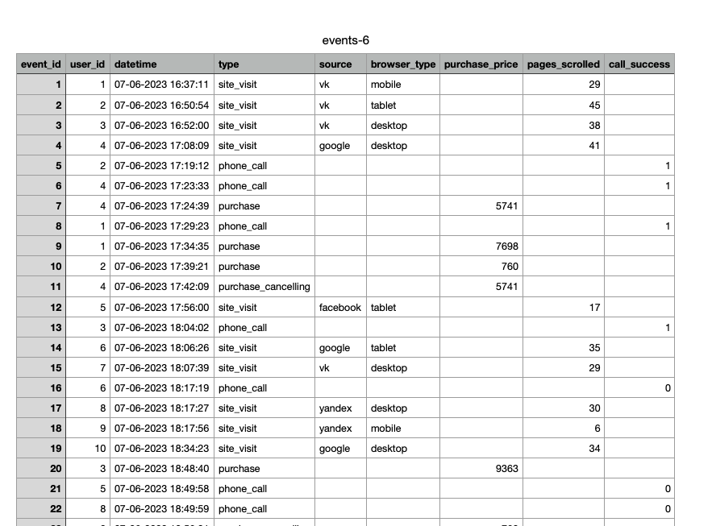

# Тестовое задание для Python-разработчика

Программа написана на python с использованием flask и sqlalchemy. У нее есть веб-интерфейс с возможностью генерации
случайных событий (удовлетворяющих заданным требованиям), просмотра этих событий на сайте,
загрузкой событий в csv файл. Также есть генерация случайных пользователей.

В конце файла есть скриншоты интерфейса программы.

### **Запуск программы**
1. Создать и активировать виртуальное окружение
2. Установить необходимые библиотеки с помощью requirements.txt
3. Запустить файл main.py

### **Описание задачи**
1. Список функций (либо классов и методов), которые будут в вашей программе с кратким описанием каждой

Основные классы: User, Event, Metric. 
* User хранит имя пользователя и его идентификатор. Необходима, если понадобиться добавить хоть какие-то
данные о пользователе. В моей реализации это имя, в задании же был только id.
* Event -- класс события. Содержит тип события (заход на сайт, звонок...), время события и 
параметры вроде браузера и источника.
* Metric -- класс, отвечающий за метрики. Содержит тип метрики (стоимость покупки, успешность звонка)
 и ее значение. Метрики вынесены в отдельный класс, чтобы не хранить в классе Event множество пустых полей.
Например, метрика "стоимость покупки" не применима к событию "посещение сайта". Если подобных метрик много,
в объекте (и, соответственно, базе данных) будет много пустых полей. Лучше вынести такое в отдельную таблицу БД
(соответственно, отдельную модель, раз использовалась ORM). Подобное можно также сделать и с параметрами,
если в реальной задаче их будет больше и они не будут универсальны для всех событий.

Основные функции:
* init_modeling -- запускает генерацию событий
* generate_event -- генерация одного случайного события. Смотрит, какие типы событий можно
генерировать (Если в базе есть только 1 событие -- посещение сайта, можно создать только новое посещение
сайта или звонок. Создать отмену покупки нельзя). Для посещения сайта создает нового пользователя,
Для покупки (например) выбирает всех пользователей, у которых последним событием был звонок.
* generate_metrics -- создает метрики для события заданного типа.
* get_time -- получить время события. В программе используется собственное время, чтобы данные были более похожи на реальные.

2. Алгоритм работы программы в виде псевдокода или сниппета на Питоне.
Код полностью представлен в репозитории https://github.com/stamplevskiyd/AdventumTask
3. Описание файла настроек, которые вы считаете нужными для данной программы.
Настройки хранятся в файле config.json. В версии программы, актуальной на момент написания этого файла,
реализованы 3 вида метрик. Цена покупки (purchase_price), число просмотренных страниц (
pages_scrolled), успешность телефонного звонка (call_success). Для них нужны минимальное
и максимальное значение (min и max). Величина метрики выбирается с помощью python random.randint,
которая принимает на вход границы диапазона.
Помимо этого есть параметр modeling, event_count (min, max) -- отвечает за генерируемое число событий.

### **Примеры работы программы**
Страница с событиями

Страница с пользователями

Пример внешнего вида csv файла

Области улучшения программы:
* Значения метрик с более разумным распределением
* Более качественный фронтенд
* Уточнение задания (вместо имен типов событий хранить в таблице их номера) -- спорный момент
